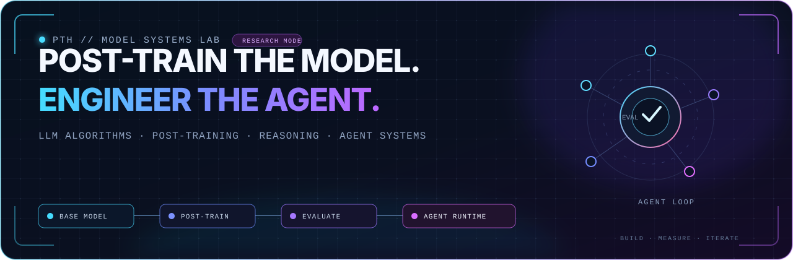

<div align="center">
  
</div>

<br />

<div align="center">
  <a href="https://github.com/pth2002"></a>
  
  
</div>

<p align="center">
  I work on <b>large-model algorithms and post-training</b>, then carry those ideas into<br />
  <b>agent systems</b> that can reason, use tools, retrieve context, and operate over long horizons.
</p>

<p align="center">
  <code>model behavior</code> → <code>training signal</code> → <code>evaluation</code> → <code>agent runtime</code>
</p>

---

## `01 / RESEARCH FOCUS`

<table>
  <tr>
    <td width="33%" valign="top">
      <h3>◈ Model Algorithms</h3>
      <p>Understanding and improving model behavior through objective design, efficient adaptation, reasoning-oriented methods, and careful algorithmic analysis.</p>
    </td>
    <td width="33%" valign="top">
      <h3>◈ Post-Training</h3>
      <p>Building data, optimization, alignment, and evaluation pipelines that turn capable base models into reliable task specialists.</p>
    </td>
    <td width="33%" valign="top">
      <h3>◈ Agent Intelligence</h3>
      <p>Designing agents around planning, tool use, memory, feedback loops, and long-horizon execution—not just a larger prompt.</p>
    </td>
  </tr>
</table>

```text
BASE MODEL
    │
    ├── data + objectives ──> POST-TRAINING ──> behavior + capability
    │                              │
    │                              └── evaluation / ablation / iteration
    │
    └── reasoning model ────> AGENT RUNTIME ──> tools + memory + environment
```

> I care about research that survives contact with strong baselines: reproducible evaluations, honest ablations, explicit scope boundaries, and negative results when the mechanism does not hold.

---

## `02 / FEATURED SYSTEM`

### [ConvMemory](https://github.com/pth2002/ConvMemory) — learned memory reranking for conversational and agent memory

ConvMemory is a lightweight learned reranker placed between vector search and prompt construction. It explores recall-oriented memory selection, evidence reranking, validity context, and conflict-aware memory editing for long-running agent systems.

```text
query → vector search → ConvMemory → validity / conflict context → agent
```

<p>
  <a href="https://github.com/pth2002/ConvMemory"></a>
  <a href="https://github.com/pth2002/ConvMemory/blob/main/paper/convmemory_report.pdf"></a>
  <a href="https://huggingface.co/Purdy0228/ConvMemory-LoCoMo-MPNet"></a>
  <a href="https://github.com/pth2002/ConvMemory/actions"></a>
</p>

```python
from convmemory import ConvMemory

memory_model = ConvMemory.from_pretrained(
    "Purdy0228/ConvMemory-LoCoMo-MPNet"
)

context = memory_model.retrieve(
    query="What changed since the last session?",
    memories=memory_candidates,
    top_k=10,
)
```

---

## `03 / HOW I BUILD`

| Principle | What it means in practice |
|---|---|
| **Algorithm before ornament** | Start from the behavior and failure mode, then choose the smallest mechanism that can change it. |
| **Evaluation is part of the model** | Treat splits, baselines, ablations, and leakage checks as first-class engineering artifacts. |
| **Agents need state** | Tools, memory, feedback, and environment interaction are core system components—not prompt decoration. |
| **Negative results are signal** | If an attribution story fails, keep the engineering value and fix the scientific claim. |

---

## `04 / TOOLCHAIN`

<div align="center">
  
  &nbsp;
  <a href="https://huggingface.co/Purdy0228"></a>
  &nbsp;
  
</div>

<p align="center">
  <code>PyTorch</code> · <code>Transformers</code> · <code>Sentence Transformers</code> ·
  <code>NumPy</code> · <code>scikit-learn</code> · <code>Hugging Face</code>
</p>

---

## `05 / CURRENT VECTOR`

```yaml
primary:   large-model algorithms + post-training
building:  reasoning and evaluation pipelines
systems:   tool-using agents with memory and feedback loops
shipping:  research code with reproducible, scoped claims
```

<div align="center">
  <a href="https://github.com/pth2002"></a>
  <a href="https://huggingface.co/Purdy0228"></a>
  <a href="https://github.com/NoetixAI"></a>
</div>

<br />

<p align="center">
  <code>BUILD → MEASURE → ABLATE → ITERATE</code>
</p>
