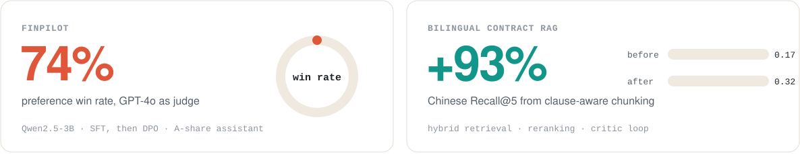
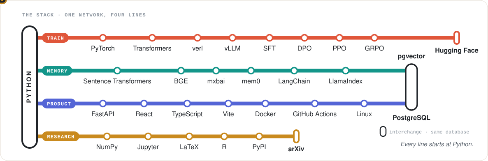

<picture>
  <source media="(prefers-color-scheme: dark)" srcset="./assets/hero-dark.svg" />
  
</picture>

  
  
  

<h3 align="center">Hi, I'm Taiheng. I make the best.</h3>

I love the moment a result has to stand up for itself. Reinforcement learning for LLMs, memory for long-running agents, evaluation that holds up under a second look: that is where I spend my days, and everything below ships with code you can run today.

##  Probe the Harness

**My new RL method won every single run. So I went bug hunting.**

Before claiming the win, I audited the training harness and caught four bugs propping it up, each one hiding behind a log that looked perfectly healthy. With all four fixed, the clean sweep became an honest tie. I packaged that hunt into PTH: point it at your verl logs and it runs the same four checks in one command, so the next surprising win in your lab gets the scrutiny it deserves.

<picture>
  <source media="(prefers-color-scheme: dark)" srcset="./assets/bugs-dark.svg" />
  
</picture>

Here is the Idle Clip caught in a real run. The clip fraction read a calm 0.000 on every update, while the sampler drifted ten thousand times further from the learner.

<picture>
  <source media="(prefers-color-scheme: dark)" srcset="https://raw.githubusercontent.com/pth2002/probe-the-harness/main/assets/signal-dark.svg" />
  
</picture>

##  ConvMemory

**Cross-encoder quality for agent memory, at a fraction of the wait.**

ConvMemory is a 14 MB reranker that slots in between your vector search and your agent. On LoCoMo it beats both BGE cross-encoders on Recall@10 and MRR in 28.6 ms per query, and lands within 2% of mxbai-rerank-large's MRR while running 68 times faster. Plug it into mem0, LangChain or LlamaIndex in about ten lines. And if you are curious how I test my own ideas, the repo includes [the five-seed study](https://github.com/pth2002/ConvMemory/blob/main/docs/posts/i-was-wrong-about-temporal-memory.md) that overturned my first explanation of why it works.

<picture>
  <source media="(prefers-color-scheme: dark)" srcset="https://raw.githubusercontent.com/pth2002/ConvMemory/main/docs/assets/pareto-dark.png" />
  
</picture>

##  More I've built

<picture>
  <source media="(prefers-color-scheme: dark)" srcset="./assets/cards-dark.svg" />
  
</picture>

**[FinPilot](https://github.com/pth2002/FinPilot): a 3B model that talks markets.** I trained Qwen2.5-3B with SFT and then DPO into an assistant for A-share investing, and a GPT-4o judge preferred its answers 74% of the time.

**[BiLegalContract-RAG-Tool](https://github.com/pth2002/BiLegalContract-RAG-Tool): long contracts, two languages, one assistant.** Hybrid retrieval, cross-encoder reranking and a critic-and-reflection loop read contracts in Chinese, English or both. Clause-aware chunking alone lifted Chinese Recall@5 by 93%.

##  What I bring

I treat evaluation as part of the product. Every comparison I run starts by checking the baseline, every claim ships with the code to reproduce it, and when the evidence changes the story, I change the story and say so out loud. That makes my wins a little rarer and a lot harder to argue with.

##  Toolbox

<picture>
  <source media="(prefers-color-scheme: dark)" srcset="./assets/toolbox-dark.svg" />
  
</picture>

  <picture>
    <source media="(prefers-color-scheme: dark)" srcset="./assets/stack-icons-dark.svg" />
    
  </picture>

##  A year of building

<picture>
  <source media="(prefers-color-scheme: dark)" srcset="https://raw.githubusercontent.com/pth2002/pth2002/output/contributions-dark.svg" />
  
</picture>

Redrawn every day by GitHub Actions from my contribution calendar.

